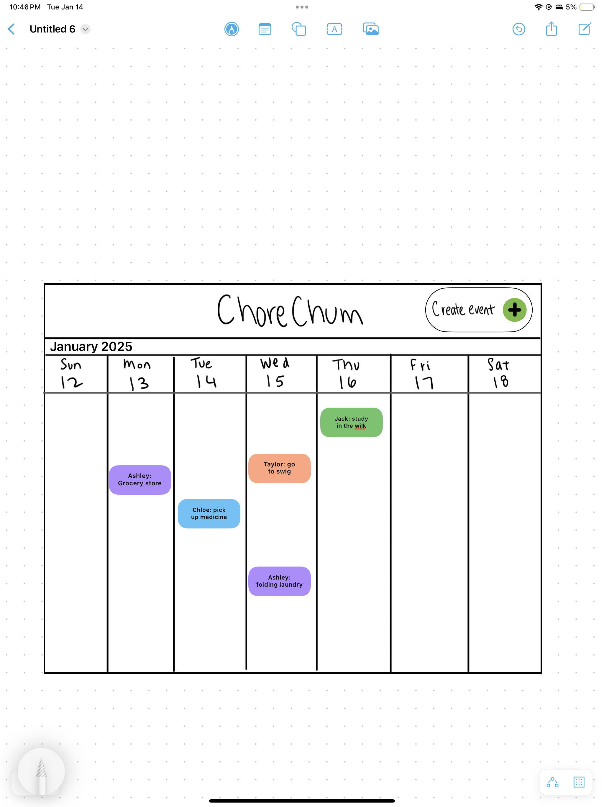
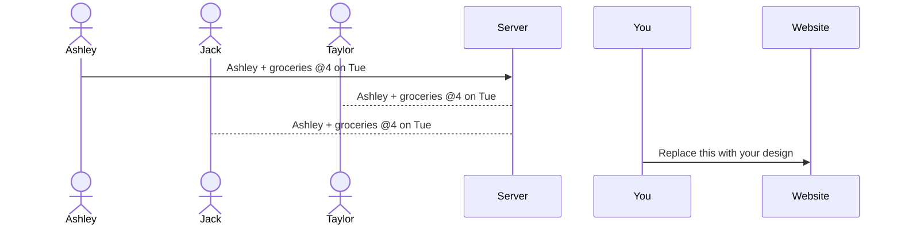

# ChoreChum

[My Notes](notes.md)

This application will allow friends to share the random errands that they need to do throughout the week and sends invites to friends to join them! 

> [!NOTE]
>  This is a template for your startup application. You must modify this `README.md` file for each phase of your development. You only need to fill in the section for each deliverable when that deliverable is submitted in Canvas. Without completing the section for a deliverable, the TA will not know what to look for when grading your submission. Feel free to add additional information to each deliverable description, but make sure you at least have the list of rubric items and a description of what you did for each item.

> [!NOTE]
>  If you are not familiar with Markdown then you should review the [documentation](https://docs.github.com/en/get-started/writing-on-github/getting-started-with-writing-and-formatting-on-github/basic-writing-and-formatting-syntax) before continuing.

## 🚀 Specification Deliverable

> [!NOTE]
>  Fill in this sections as the submission artifact for this deliverable. You can refer to this [example](https://github.com/webprogramming260/startup-example/blob/main/README.md) for inspiration.

For this deliverable I did the following. I checked the box `[x]` and added a description for things I completed.

- [ ] Proper use of Markdown
- [ ] A concise and compelling elevator pitch
- [ ] Description of key features
- [ ] Description of how you will use each technology
- [ ] One or more rough sketches of your application. Images must be embedded in this file using Markdown image references.

### Elevator pitch

College students hate doing things by themselves. Let be honest though, most people think errands would be more enjoyable if a friend joined them. The ChoreChum application will allow friends to share errands that they have to run and invite others to come along! It will give an option for if something is flexible as well, so that friends can ask for a time change if needed. If a friend chooses to join a certain errand, it will notify the poster so they can reach out with any details.

### Design

Lorem ipsum dolor sit amet, consectetur adipiscing elit, sed do eiusmod tempor incididunt ut labore et dolore magna aliqua. Ut enim ad minim veniam, quis nostrud exercitation ullamco laboris nisi ut aliquip ex ea commodo consequat. Duis aute irure dolor in reprehenderit in voluptate velit esse cillum dolore eu fugiat nulla pariatur. Excepteur sint occaecat cupidatat non proident, sunt in culpa qui officia deserunt mollit anim id est laborum.

### Key features

- Secure login for users through HTTPS
- Ability to "post" errands on the calendar for friends to see
- Ability to add descriptions and flexibility to errands
- Display of errands that friends have posted in a calendar view

### Technologies

I am going to use the required technologies in the following ways.

- **HTML** - Uses correct HTML structure for application. Three HTML pages. One for login, one for the calendar itself where people can add events, and one to see friends list and add new people. 
- **CSS** - Application styling that is pleasing to the eye and easy to look at. Also adds color coordinating by friend.
- **React** - Provides login, ability to add new events and friends,and use of React for routing and components.
- **Service** - Backend service with endpoints for:
    - login
    - retrieving events from friends
    - choosing to join on an errand
- **DB/Login** - Stores users, events hosted, events joined, and friends list in database. Register and login users. Credentials securely stored in database. Can't post events unless authenticated.
- **WebSocket** - As each user hosts an errand, those events are broadcasted to those in friends list.

## 🚀 AWS deliverable

For this deliverable I did the following. I checked the box `[x]` and added a description for things I completed.

- [ ] **Server deployed and accessible with custom domain name** - [My server link](https://yourdomainnamehere.click).

## 🚀 HTML deliverable

For this deliverable I did the following. I checked the box `[x]` and added a description for things I completed.

- [ ] **HTML pages** - I did not complete this part of the deliverable.
- [ ] **Proper HTML element usage** - I did not complete this part of the deliverable.
- [ ] **Links** - I did not complete this part of the deliverable.
- [ ] **Text** - I did not complete this part of the deliverable.
- [ ] **3rd party API placeholder** - I did not complete this part of the deliverable.
- [ ] **Images** - I did not complete this part of the deliverable.
- [ ] **Login placeholder** - I did not complete this part of the deliverable.
- [ ] **DB data placeholder** - I did not complete this part of the deliverable.
- [ ] **WebSocket placeholder** - I did not complete this part of the deliverable.

## 🚀 CSS deliverable

For this deliverable I did the following. I checked the box `[x]` and added a description for things I completed.

- [ ] **Header, footer, and main content body** - I did not complete this part of the deliverable.
- [ ] **Navigation elements** - I did not complete this part of the deliverable.
- [ ] **Responsive to window resizing** - I did not complete this part of the deliverable.
- [ ] **Application elements** - I did not complete this part of the deliverable.
- [ ] **Application text content** - I did not complete this part of the deliverable.
- [ ] **Application images** - I did not complete this part of the deliverable.

## 🚀 React part 1: Routing deliverable

For this deliverable I did the following. I checked the box `[x]` and added a description for things I completed.

- [ ] **Bundled using Vite** - I did not complete this part of the deliverable.
- [ ] **Components** - I did not complete this part of the deliverable.
- [ ] **Router** - Routing between login and voting components.

## 🚀 React part 2: Reactivity

For this deliverable I did the following. I checked the box `[x]` and added a description for things I completed.

- [ ] **All functionality implemented or mocked out** - I did not complete this part of the deliverable.
- [ ] **Hooks** - I did not complete this part of the deliverable.

## 🚀 Service deliverable

For this deliverable I did the following. I checked the box `[x]` and added a description for things I completed.

- [ ] **Node.js/Express HTTP service** - I did not complete this part of the deliverable.
- [ ] **Static middleware for frontend** - I did not complete this part of the deliverable.
- [ ] **Calls to third party endpoints** - I did not complete this part of the deliverable.
- [ ] **Backend service endpoints** - I did not complete this part of the deliverable.
- [ ] **Frontend calls service endpoints** - I did not complete this part of the deliverable.

## 🚀 DB/Login deliverable

For this deliverable I did the following. I checked the box `[x]` and added a description for things I completed.

- [ ] **User registration** - I did not complete this part of the deliverable.
- [ ] **User login and logout** - I did not complete this part of the deliverable.
- [ ] **Stores data in MongoDB** - I did not complete this part of the deliverable.
- [ ] **Stores credentials in MongoDB** - I did not complete this part of the deliverable.
- [ ] **Restricts functionality based on authentication** - I did not complete this part of the deliverable.

## 🚀 WebSocket deliverable

For this deliverable I did the following. I checked the box `[x]` and added a description for things I completed.

- [ ] **Backend listens for WebSocket connection** - I did not complete this part of the deliverable.
- [ ] **Frontend makes WebSocket connection** - I did not complete this part of the deliverable.
- [ ] **Data sent over WebSocket connection** - I did not complete this part of the deliverable.
- [ ] **WebSocket data displayed** - I did not complete this part of the deliverable.
- [ ] **Application is fully functional** - I did not complete this part of the deliverable.
